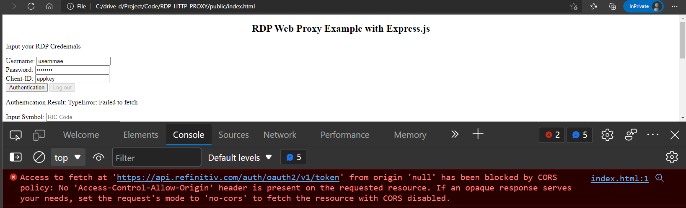
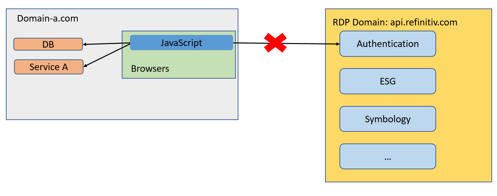
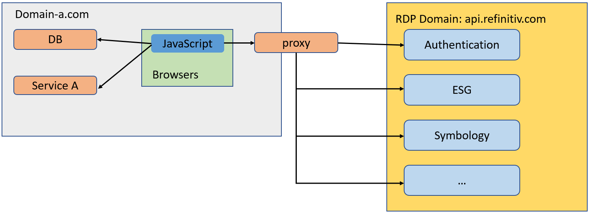

# How to set up HTTP Proxy for the Refinitiv Data Platform APIs on web browser with Express.js
- Last update: February 2022
- Environment: Windows 
- Compiler: Node.js
- Prerequisite: Refinitiv Data Platform credentials.

Example Code Disclaimer:
ALL EXAMPLE CODE IS PROVIDED ON AN “AS IS” AND “AS AVAILABLE” BASIS FOR ILLUSTRATIVE PURPOSES ONLY. REFINITIV MAKES NO REPRESENTATIONS OR WARRANTIES OF ANY KIND, EXPRESS OR IMPLIED, AS TO THE OPERATION OF EXAMPLE CODE, OR THE INFORMATION, CONTENT OR MATERIALS USED IN CONNECTION WITH EXAMPLE CODE. YOU EXPRESSLY AGREE THAT YOUR USE OF EXAMPLE CODE IS AT YOUR SOLE RISK

## <a id="overview"></a>Overview

The [Refinitiv Data Platform (RDP) APIs](https://developers.refinitiv.com/en/api-catalog/refinitiv-data-platform/refinitiv-data-platform-apis) provide various Refinitiv data and content for developers via easy-to-use Web-based API. The developers which are data scientists, financial coder, or traders can use any programming languages that support HTTP request-response and JSON messages to retrieve content from the RDP in a straightforward way on any platform.

However, if you are a web developer, your JavaScript application cannot connect to the RDP directly because of the [***Same-origin***](https://developer.mozilla.org/en-US/docs/Web/Security/Same-origin_policy) policy. All web browsers enforce this policy to prevent browsers access different domain/server resources. And of cause, your web server/web application domain is always different from the RDP because they are hosted on different sites. 

This example project shows how to use a reverse proxy to make the JavaScript on a web browser can connect and consume data from the RDP endpoints. It utilizes  
the [http-proxy](https://www.npmjs.com/package/http-proxy) module and [Express.js](https://expressjs.com/) web framework for the webserver and reverse proxy functionalities. 

**Note**:
Please be informed that this article and example projects aim for Development and POC purposes only. This kind of reverse proxy implementation is not recommended for Production use. You may use the de-facto server like [Nginx](https://www.nginx.com/) for the reverse proxy in your environment. Alternatively, you may use [the RDP Implicit Grant](https://developers.refinitiv.com/en/api-catalog/refinitiv-data-platform/refinitiv-data-platform-apis/tutorials#authorization-for-browser-based-applications).

## <a id="cross_domain"></a>Why we need a Reverse Proxy?

Let's get back to the first question, why the web browsers cannot connect to the RDP APIs directly? Typically, the web browsers *do not allow* your JavaScript code to calls a 3rd party Web API that locates on a different server (cross-domain request). Browsers allow only the HTTP response has a Control-Allow-Origin ([Cross-Origin Resource Sharing - CORS](https://developer.mozilla.org/en-US/docs/Web/HTTP/CORS)) header with a * value or your client's domain. Please see the following scenario as an example.



The above scenario is the browser opens the file from a local file ```file:///C:/drive_d/Project/Code/RDP_HTTP_PROXY/public/index.html``` location.
1. It means the domain of this web is on a local machine (```file:///C```).
2. JavaScript application sends the authentication request message to the RDP Authentication service at  ```https://api.refinitiv.com``` URL which is on a different domain.  
3. The browser blocks the request and throws an error message about CORS (Cross-Origin Resource Sharing). 
4. JavaScript gets an error message, not the RDP Tokens, so it cannot continue requesting data with other RDP endpoints.

This browser's behavior can be illustrated with the following diagram.



The 3rd Party Web APIs do not need to be the RDP specifically, it can be your microservice that is hosted on a different domain too. So, how can we handle this? You can build the API Gateway as a reverse proxy to redirect traffic to the different services according to the URL of the request.



**As of February 2022**:
Some RDP services like the Environmental - Social - and Governance (ESG), News, Symbology, etc support the cross-domain Control-Allow-Origin. You can call them directly from the web browsers (if you already have the access token). However, I am going to apply those calls with the proxy for easy management and prevent any future changes.

You can use other libraries/tools to do proxy work for you like this [Refinitiv-API-Samples/Example.RDPAPI.TypeScript.AngularESGWebapp](https://github.com/Refinitiv-API-Samples/Example.RDPAPI.TypeScript.AngularESGWebapp) project that uses [Angular](https://angular.io/) platform as a proxy on the client-side. 

**Note**:
Let me remind you again, this proxy implementation aims for Development and POC purposes only. It is not recommended for Production use. You may use the de-facto server like [Nginx](https://www.nginx.com/) for the reverse proxy in your environment. Alternatively, you may use [the RDP Implicit Grant](https://developers.refinitiv.com/en/api-catalog/refinitiv-data-platform/refinitiv-data-platform-apis/tutorials#authorization-for-browser-based-applications).

## <a id="expressjs-proxy"></a>Express.js with HTTP-Proxy

Let’s start with the server-side application. This example uses the [Node.js](https://nodejs.org/en/) with [Express.js](https://expressjs.com/) frameworks.

### Set Up Express.js web-server

Firstly, create a web-server with Express.js to serve the static contents (available in the folder named ```public```). The server file named is ```server.js```.


```
//server.js
const path = require('path')
const express = require('express')

const app = express()
const port = process.env.PORT || 8080 //Support both local environment and deployed location

const publicDirectoryPath = path.join(__dirname, './public')
app.set('x-powered-by' , 'Express.js')
// Setup static directory to serve
app.use(express.static(publicDirectoryPath))

//Start the server
app.listen(port, () => {
    console.log(`Server is up on port ${port}.`)
})
```
### Set Up HTTP-Proxy for the RDP Authentication reverse proxy

Next, create a proxy object as the ```apiProxy``` object with the http-proxy module in the ```server.js```  file.

```
//server.js
const httpProxy = require('http-proxy'); //Import the HTTP-Proxy module

//Use this options for creating a reverse proxy to other domains.
const options = {
    changeOrigin: true,
    target: {
        https: true
    }
}
//Create a reverse proxy server
const apiProxy = httpProxy.createProxyServer(options);
```

Then, apply the RDP API URL ```https://api.refinitiv.com``` to the apiProxy and Express.js ```/auth/oauth2/<version>/*``` route.

```
//server.js
const rdpServer = process.env.RDP_BASE_URL //https://api.refinitiv.com
const rdpAuthVersion = process.env.RDP_AUTH_VERSION

//For the RDP Authentication service
app.post(`/auth/oauth2/${rdpAuthVersion}/*`, (req, res) => {
    console.log(`redirecting to RDP ${req.url}`)
    apiProxy.web(req, res, {target: rdpServer})
})
```

The code above handles HTTP Post for the ```/auth/oauth2/<version>/*``` operation route, then uses the http-proxy ```web()``` function to redirect incoming HTTP request message (request body, request headers, request auth, etc) to the target RDP API server as follows:
- Redirect incoming HTTP Post request message for ```/auth/oauth2/v1/token``` to the RDP ```https://api.refinitiv.com/auth/oauth2/v1/token``` endpoint.
- Redirect incoming HTTP Post request message for ```/auth/oauth2/v1/revoke``` to the RDP ```https://api.refinitiv.com/auth/oauth2/v1/revoke``` endpoint.

Please noticed that I store all RDP endpoint versions in the Environment variable, so if there is any version update, I do not need to change the source code. 

Example of Environment variables (or ```.env``` file):

```
RDP_BASE_URL=https://api.refinitiv.com
RDP_AUTH_VERSION=v1
RDP_ESG_VERSION=v2
RDP_SYMBOLOGY_VERSION=v1
RDP_NEWS_VERSION=v1
```
### Set Up Reverse Proxy for other endpoints

Next, add more HTTP route handlers for the ESG, News, and Symbology services.

```
//server.js
const rdpEsgVersion = process.env.RDP_ESG_VERSION
const rdpNewsVersion = process.env.RDP_NEWS_VERSION
const rdpSymbologyVersion = process.env.RDP_SYMBOLOGY_VERSION

//For the RDP Symbology service 
app.post(`/discovery/symbology/${rdpSymbologyVersion}/lookup`, (req, res) => {
    console.log(`redirecting to RDP ${req.url}`)
    apiProxy.web(req, res, {target: rdpServer})
})

//For the RDP ESG service 
app.get(`/data/environmental-social-governance/${rdpEsgVersion}/views/*`, (req, res) => {
    console.log(`redirecting to RDP ${req.url}`)
    apiProxy.web(req, res, {target: rdpServer})
})

//For the RDP News service 
app.get(`/data/news/${rdpNewsVersion}/headlines/`, (req, res) => {
    console.log(`redirecting to RDP ${req.url}`)
    apiProxy.web(req, res, {target: rdpServer})
})

//Start the server
app.listen(port, () => {
    console.log(`Server is up on port ${port}.`)
})
```
The code above handles HTTP operations for the RDP request messages, then redirect incoming HTTP request message (request body, request headers, request auth, etc) to the target RDP API server with http-proxy ```web()``` function as follows:
- Redirect incoming HTTP Post request message for ```/discovery/symbology/v1/lookup``` to the RDP ```https://api.refinitiv.com/discovery/symbology/v1/lookup``` endpoint.
- Redirect incoming HTTP Get request message for ```/data/environmental-social-governance/v2/views/*``` to the RDP ```https://api.refinitiv.com/data/environmental-social-governance/v2/views/*``` endpoint.
- Redirect incoming HTTP Get request message for ```/data/news/v1/headlines/``` to the RDP ```https://api.refinitiv.com/data/news/v1/headlines/``` endpoint.

Now the server.js web-server application is ready to serve static contents and does a reverse-proxy of the RDP operations.

## <a id="client-side-js"></a>Client-Side JavaScript

Moving on to the client-side JavaScript on the web browsers. This example uses Vanilla JavaScript (aka pure JavaScript), so the same concept can be applied to any JavaScript framework too. The client-side JavaScript application file named is ```app.js```.

### Authorization for the RDP tokens

RDP APIs entitlement check is based on OAuth 2.0 specification. The first step of an application workflow is to get a token, which will allow access to the protected resource, i.e. data REST APIs. The API requires the following access credential information:
- Username: The username. 
- Password: Password associated with the username. 
- Client ID: This is also known as ```AppKey```, and it is generated using an Appkey Generator. This unique identifier is defined for the user or application and is deemed confidential (not shared between users). The client_id parameter can be passed in the request body or as an “Authorization” request header that is encoded as base64.

The application needs to send an HTTP Post message with the access credentials to the RDP Auth Service endpoint. However, the RDP Auth Service does not support CORS, so the client-side application sends the authentication request message to a proxy server (*server.js*) ```/auth/oauth2/v1/token``` endpoint instead. The server.js just redirects our HTTP Post message to the RDP server, and redirects RDP's response message back to the *app.js*. 

```
//app.js

const authenRDP = async (opt) => {

    const authenURL = `/auth/oauth2/${rdpAuthVersion}/token`

    let authReq = {
        'username': opt['username'],
        'client_id': opt['client_id'],
        takeExclusiveSignOnControl
    }

     //First Login
    if (opt['refresh_token'].length === 0) {
        authReq['password'] = opt['password']
        authReq['grant_type'] = 'password'
        authReq['scope'] = scope
    } 

    // Send HTTP Request
    const response = await fetch(authenURL, {
        method: 'POST',
        headers: {
            'Content-Type': 'application/x-www-form-urlencoded'
        },
        body: new URLSearchParams(authReq)
    })

    if (!response.ok) {
        const statusText = await response.text()
        throw new Error(`HTTP error!: ${response.status} ${statusText}`);
    }
    //Parse response to JSON
    authResponse = await response.json()
    //Set Token information to variables
    access_token = authResponse.access_token
    refresh_token = authResponse.refresh_token
    expires_in = authResponse.expires_in
    console.log('Authentication Granted')

}
```

The ```authenRDP()``` function uses the [Fetch API](https://developer.mozilla.org/en-US/docs/Web/API/Fetch_API) to send HTTP request messages for both first login (```authReq['grant_type'] = 'password'```) and refresh token (```authReq['grant_type'] = 'refresh_token'```) scenarios to the RDP Auth service (via *server.js*). 

Once the authentication success, the function gets the RDP Auth service response message (via *server.js*), and keeps the following RDP token information in the client-side variables.
- **access_token**: The token used to invoke REST data API calls as described above. The application must keep this credential for further RDP/Refinitiv Real-Time - Optimized requests.
- **refresh_token**: Refresh token to be used for obtaining an updated access token before expiration. The application must keep this credential for access token renewal.
- **expires_in**: Access token validity time in seconds.

For the full detail and explanation of the RDP Authentication process application workflow, please refer to the following RDP APIS tutorials:
- [Introduction to the Request-Response API](https://developers.refinitiv.com/en/api-catalog/refinitiv-data-platform/refinitiv-data-platform-apis/tutorials#introduction-to-the-request-response-api).
- [Authorization - All about tokens](https://developers.refinitiv.com/en/api-catalog/refinitiv-data-platform/refinitiv-data-platform-apis/tutorials#authorization-all-about-tokens).
- [Authorization in Python](https://developers.refinitiv.com/en/api-catalog/refinitiv-data-platform/refinitiv-data-platform-apis/tutorials#authorization-in-python).

### RDP tokens renewal

Before the session expires, the application needs to send a Refresh Grant request message to get a new access token. Let' us modify the ```authenRDP()``` function to support the Refresh Grant request too.

```
//app.js

const authenRDP = async (opt) => {

    const authenURL = `/auth/oauth2/${rdpAuthVersion}/token`

    let authReq = {
        'username': opt['username'],
        'client_id': opt['client_id'],
        takeExclusiveSignOnControl
    }

    //First Login
    if (opt['refresh_token'].length === 0) {
        authReq['password'] = opt['password']
        authReq['grant_type'] = 'password'
        authReq['scope'] = scope
    } else { //Refresh Token
        authReq['refresh_token'] = opt['refresh_token']
        authReq['grant_type'] = 'refresh_token'
    }


    // Send HTTP Request
    ...
    // Define the timer to refresh our token 
    setRefreshTimer()

}

//Send a Refresh Grant message before Access Token's expires (expires_in time)
const setRefreshTimer = () => {
    let millis = (parseInt(expires_in) - 30) * 1000; //
    let intervalID = window.setInterval(async () => {
        try {
            await authenRDP({
                username,
                client_id,
                refresh_token
            })
        } catch (error) {
            console.log(error)
            authenResult.textContent = error
        }
    }, millis);
}
```

Now the *app.js* supports both the Password Grant and Refresh Grant scenarios for the RDP APIs with a single ```authenRDP()``` function. That covers the authentication part of the *app.js* client-side application.

### Requesting RDP APIs Data

That brings us to requesting the RDP APIs data. All subsequent REST API calls use the Access Token via *Authorization* HTTP request message header as shown below to get the data. 
- Header: 
    * Authorization = ```Bearer <RDP Access Token>```

Please notice *the space* between the ```Bearer``` and ```RDP Access Token``` values.

The application then creates a request message in a JSON message format or URL query parameter based on the interested service and sends it as an HTTP request message to the Service Endpoint. Developers can get RDP APIs the Service Endpoint, HTTP operations, and parameters from Refinitiv Data Platform's [API Playground page](https://api.refinitiv.com/) - which an interactive documentation site developers can access once they have a valid Refinitiv Data Platform account.

This project demonstrates with the following the RDP Services:
- ESG Service ```/views/basic``` operation that provides a basic overview of 6 common ESG Data for consumers.
- News Service ```/headlines``` operation.
- Discovery Service ```/lookup``` endpoint that navigates between identifiers or map identifiers to PermIDs.

All HTTP request messages from the client-side *app.js* are sent to the *server.js*. The http-proxy module redirects the request message to the RDP Service and forwards the response message from the RDP to the client-side. 

Note: as of February 2022, the current version of the RDP ESG Service is **v2**.

```
//app.js

// Request Environment, Social, and Governance (ESG) Data
const requestESG = async (symbol, accessToken) => {

    const esgURL = `/data/environmental-social-governance/${rdpEsgVersion}/views/basic?universe=${symbol}`

    // Send HTTP Request
    const response = await fetch(esgURL, {
        method: 'GET',
        headers: {
            'Content-Type': 'application/json',
            'Authorization': `Bearer ${accessToken}`
        }
    })

    if (!response.ok) {
        const statusText = await response.text()
        throw new Error(`HTTP error!: ${response.status} ${statusText}`);
    }
    //Parse response to JSON
    return await response.json()
}


// Request News Headlines Data
const getNewsHeadlines = async (symbol, accessToken) => {

    const rdpNewsURL = `/data/news/v1/headlines?query=${symbol}`

    const response = await fetch(rdpNewsURL, {
        method: 'GET',
        headers: {
            'Content-Type': 'application/json',
            'Authorization': `Bearer ${accessToken}`
        }
    })

    if (!response.ok) {
        const statusText = await response.text()
        throw new Error(`HTTP error!: ${response.status} ${statusText}`);
    }
    //Parse response to JSON
    return await response.json()
}

// RDP Symbology Lookup Data
const getSymbology = async (symbol, reqBody, accessToken) => {

    const rdpSymbologyURL = `/discovery/symbology/${rdpSymbologyVersion}/lookup`

    const response = await fetch(rdpSymbologyURL, {
        method: 'POST',
        headers: {
            'Content-Type': 'application/json',
            'Authorization': `Bearer ${accessToken}`
        },
        body: JSON.stringify(reqBody)
    })

    if (!response.ok) {
        const statusText = await response.text()
        throw new Error(`HTTP error!: ${response.status} ${statusText}`);
    }
    //Parse response to JSON
    return await response.json()
}
```

The ```getSymbology()``` function supports two scenarios, converting the RIC code to ISIN and Exchange Ticker codes, and converting the RIC code to PermID code. The difference is the JSON request body. Users can click the buttons to choose which scenario to perform.

The code below shows how to convert RIC code to ISIN and Exchange Ticker codes.

```
btnSymbology.addEventListener('click', async () => {

    const symbol = inputDataSymbol.value
    
    const reqBody = {
        "from": [{
            "identifierTypes": [
                "RIC"
            ],
            "values": [symbol]
        }],
        "to": [{
            "identifierTypes": [
                "ISIN",
                "ExchangeTicker"
            ]
        }],
        "reference": [
            "name",
            "status",
            "classification"
        ],
        "type": "auto"
    }

    txtSymbology.value = 'Loading...'

    try {
        let data = await getSymbology(symbol, reqBody, access_token)
        txtSymbology.value = JSON.stringify(data, undefined, 2)
    } catch (error) {
        console.log(error)
        txtSymbology.value = error
    }
})
```

The code below shows how to convert RIC code to PermID Code.

```
btnRDPPermID.addEventListener('click', async () => {

    const symbol = inputDataSymbol.value

    const reqBody = {
        "from": [{
            "identifierTypes": [
                "RIC"
            ],
            "values": [symbol]
        }],
        "to": [{
            "objectTypes": [
                "organization"
            ],
            "identifierTypes": [
                "PermID",
            ]
        }],
        "reference": [
            "name",
            "status",
            "classification"
        ],
        "type": "auto"
    }

    txtRDPPermID.value = 'Loading...'
    try {
        let data = await getSymbology(symbol, reqBody, access_token)
        txtRDPPermID.value = JSON.stringify(data, undefined, 2)
    } catch (error) {
        console.log(error)
        txtRDPPermID.value = error
    }
})
```
That covers the basic HTTP operations workflow of the client-side *app.js* code. 

## <a id="prerequisite"></a>Prerequisite
This demo project requires the following dependencies software.
1. RDP Access credentials.
2. [Node.js](https://nodejs.org/en/) JavaScript runtime.
3. Internet connection.

Please contact your Refinitiv's representative to help you to access the RDP account and services. You can find more detail regarding the RDP access credentials set up from the lease see the *Getting Started for User ID* section of [Getting Start with Refinitiv Data Platform article](https://developers.refinitiv.com/en/article-catalog/article/getting-start-with-refinitiv-data-platform) article.

### <a id="python_example_run"></a>How to run the example with Docker

Please be informed that you need the [Docker Desktop/Engine](https://docs.docker.com/get-docker/) to run the example with Docker. 

1. Go to the project folder and create a file name ```.env```  with the following content.
    ```
    RDP_BASE_URL=https://api.refinitiv.com
    RDP_AUTH_VERSION=v1
    RDP_ESG_VERSION=v2
    RDP_SYMBOLOGY_VERSION=v1
    RDP_NEWS_VERSION=v1
    ```
2. Run ```$> docker build -t <project tag name> .``` command in a console to build an image from a Dockerfile.
    ```
    $> docker build -t rdp-http-proxy .
    ```
3. Once the build is a success, you can create and run the container with the following command
    ```
    $> docker run --name rdp-http-proxy -it --env-file .env rdp-http-proxy
    ```
4. Open the **http:localhost:8080** URL in your web browser to run the example web application.
5. You can stop and remove a container with the following commands.
    ```
    $> docker stop rdp-http-proxy
    $> docker rm rdp-http-proxy
    ```
